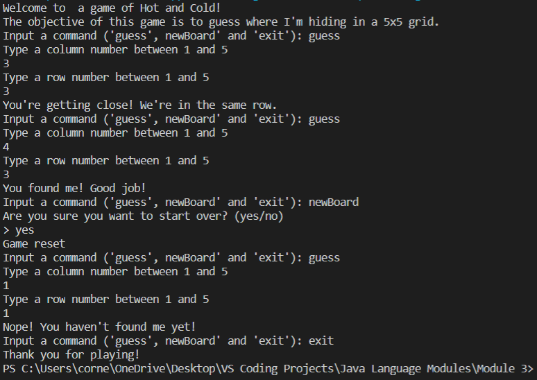

# Overview
A simple game-like program that allows the user to play a little Hot and Cold game. Can be replayed with out exiting the program. Created with Java, Visual Studio Code, and Github/GIT

# Developement Enviroment

* Visual Studio Code
* Java 8

# Execution

To run the program: Type 'javac hotAndCold.java' to compile and then 'java hotAndCold' to run. Or, you can simply click the play button in VS Code

# Useful Information

[Java documentation](https://docs.oracle.com/javase/tutorial/)
[Helpful Java website](https://www.w3schools.com/java/default.asp)